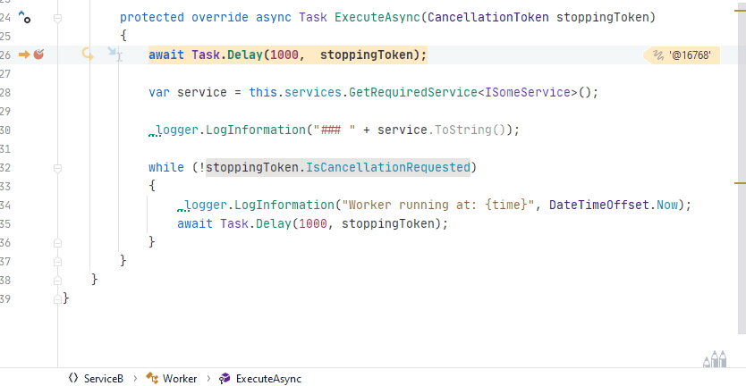

# RiderExceptionDemo

Demonstrates weird Rider debugging behavior when exceptions are thrown in async code.

If you start **ServiceB** with a debugger and without any breakpoints no exception popup is shown.
Because I have *Any exception* and *Only in my Code* enabled, I should get one of those exception popup windows.
But instead, the application just runs without any visible error. 

If you set a breakpoint in the code (`ServiceB.cs`) that will cause an exception (line 28 will cause an exception), you don't get an exception popup either. 
What's event weirder is that, when you hit F10, the method execution seems to skip to line 52. That's where you also get the exception little lighting bolt.

